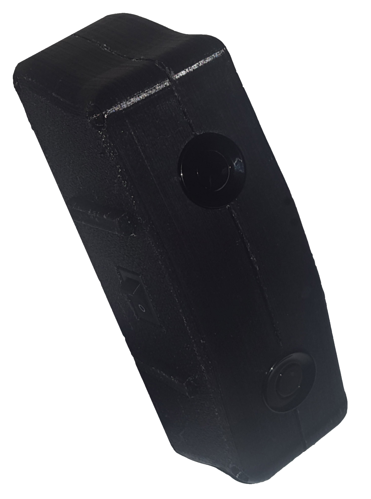
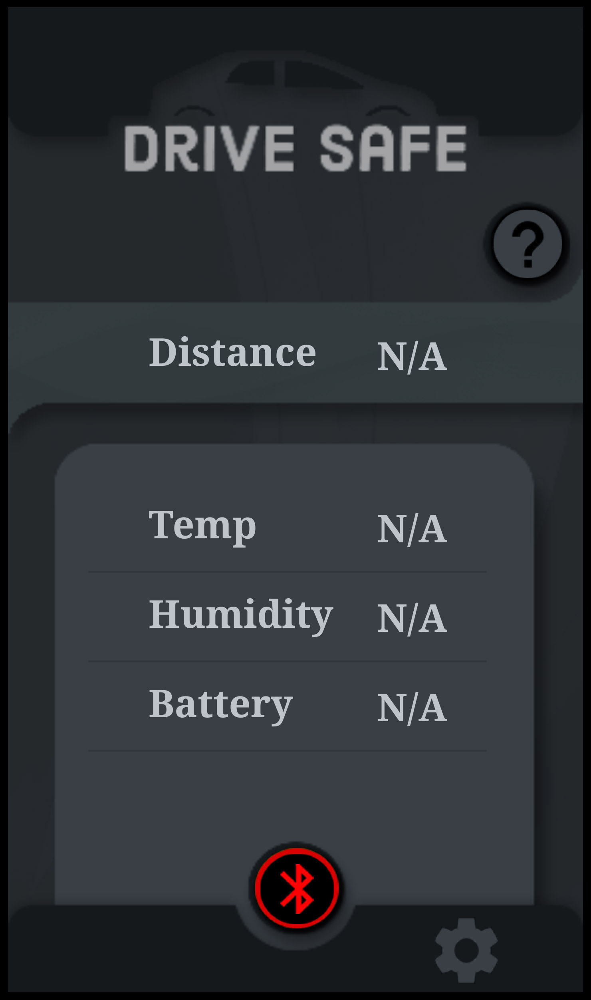
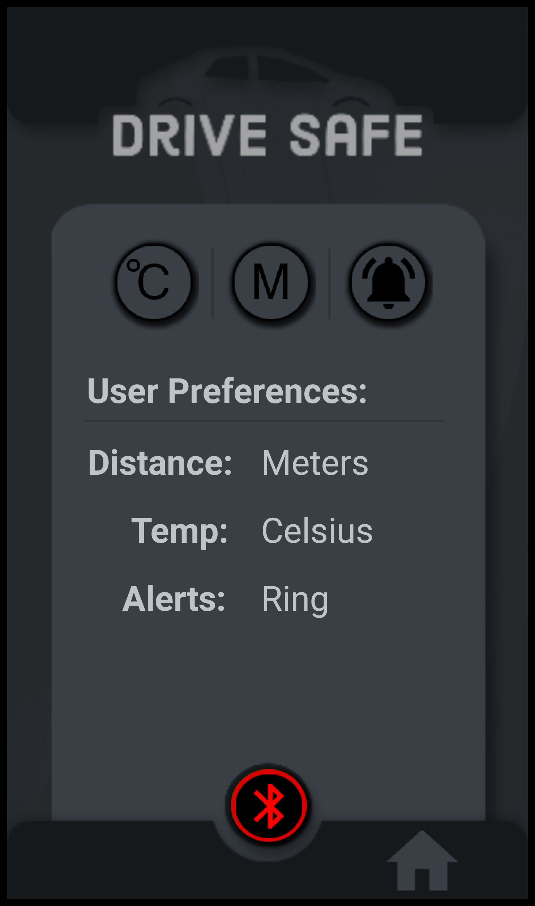
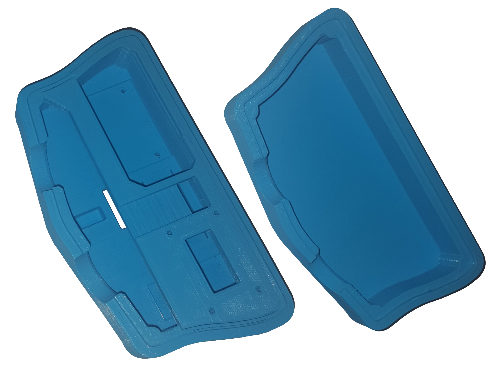

# 
**Driving Safety and Collision Prevention Module**

 
 
 

IoT product built using the Arduino infrastructure to specialize in gathering valuable information to keep you and
your vehicle safe. The device uses strong magnets to attach to any metallic surface at an angle of the user’s choice and uses Ultrasonic
to track distance to objects and other tech for temp and humidity. 

Gathered data is relayed to the user through Bluetooth to the Android app to warn and alert the user when objects are detected within range posing a danger.

**Backend:**   Arduino C++  
**Frontend:** MIT App Inventor

**Product requirements:**
- Cost Effective
- Response Time
- Portability
- Weather and Splash Resistant
- User Customization  

Requirements and constraints were developed with competitive market products in mind and with respect to automobile equipment safety regulations.
 
# 
## 
Android App

 

  
&nbsp; &nbsp; &nbsp; &nbsp;
  

    The Front-End Android app is responsible for receiving the processed data from the hardware and presenting it to the user along with warning alerts when necessary. The application is built using the MIT App Inventor framework and connects to the brains of the device using Bluetooth.

  
  
# 
## 
Circuit Diagram Design

  

  
   
  Components:  
  
    - Arduino Nano
    - JSN-SR04T
    - HC-05
    - DHT11
    - SW520D  
    - Buzzer 

  
Circuit Diagram designed in EasyEDA.  

 

# 
## 
Product 3d Housing Case 

  
 
 
The image to the right represents the first iteration of the 3d model design detailing interior with an emphasis component cutouts and cable management.
 
 
An image of the final iteration of the product can be found at the top of this readme with improvements to the interior space, upgraded shelf, and the addition of bottom-side standoffs.
 
 
 
Modeling Software: Autodesk 3ds Max

 

 
 

  The project has been a valuable learning experience in terms of building a product from start to finish with respect to automobile equipment safety regulations and competitive to similar products on the market.

